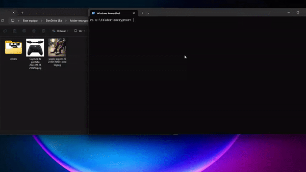

# 🛡️ Secure File Encryption Script



## Overview
This script provides a convenient way to encrypt files and folders using a secure method. It uses the Fernet encryption scheme to ensure your data remains confidential.

**Note:** While the encryption method is considered secure, the author is not responsible for any data loss or vulnerabilities.

## Features
- Encrypts both file content and names for added security.
- User-friendly command-line interface.
- Real-time progress updates during encryption/decryption.

## How to Use
1. Install the required Python libraries: `cryptography`.
2. Run the script in your terminal.
3. Choose between encrypting (E) or decrypting (D) a folder.
4. Enter the folder path and, if prompted, the password.

## Example
```
Encrypt or Decrypt? (E/D): E
Folder path: /path/to/your/folder
Password: *********
```

## Disclaimer
This script utilizes a secure encryption method; however, **I am not** responsible for any data loss or vulnerabilities.

## License
This project is under the [MIT License](LICENSE).
